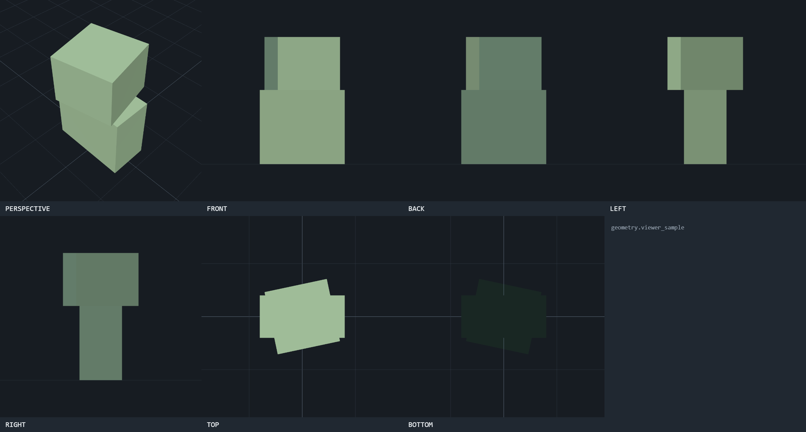

# Minecraft Entity Viewer

A local review tool for rendering Blockbench/Minecraft Bedrock entity models before loading them into Minecraft. It is designed for a repeatable **edit in Blockbench → render fixed views → compare to the reference → revise** loop.



**Status:** usable v1.0 local tool. The parser, transforms, UV behavior, server boundary, and command-line capture path are tested. Minecraft runtime behavior remains deliberately out of scope.

The viewer is intentionally practical rather than flashy. It supports:

- Blockbench `.bbmodel` project files
- Minecraft Bedrock `.geo.json` geometry files using `minecraft:geometry`
- PNG texture atlases, including textures embedded in a `.bbmodel`
- fixed front, back, left, right, top, bottom, and perspective views
- orthographic cameras for all six directional views
- automatic model framing, nearest-neighbor texture rendering, grids, axes, and wireframe mode
- exact unlit atlas colors for Blockbench-like texture inspection
- depth-correct cutout transparency for Minecraft entity atlases
- an optional reference image shown side by side or as an opacity-controlled overlay
- current-view PNG and seven-view contact-sheet export
- a command-line capture workflow for Codex and automation
- optional exact masks, lit clay, and deterministic per-cube part-ID sidecars for diagnostic captures

## Who it is for

This viewer is for Bedrock creators who want consistent screenshots between Blockbench revisions, especially when comparing silhouette, proportions, pivots, cube placement, UVs, or texture work. It is not a replacement for Blockbench or Minecraft.

## First-time setup

Requirements: Node.js 20+ and Microsoft Edge.

```powershell
npm.cmd ci
```

Dependencies are local to this folder. The viewer itself does not upload models, textures, or reference images anywhere.

## Open the viewer

Double-click `launch-viewer.bat`, or run:

```powershell
npm.cmd start
```

Then open [http://127.0.0.1:4173](http://127.0.0.1:4173).

Use **Open model files** to select a model and texture together. For a resource-pack project, **Open project folder** is usually easiest: the viewer searches the chosen folder for supported geometry and PNG files, then chooses the most likely texture. You can override both geometry and texture with the dropdowns.

## Recommended visual-comparison workflow

1. Save/export the current Blockbench project as `.bbmodel`, or save the Bedrock model as `.geo.json` with its PNG texture.
2. Open the model and texture in the viewer.
3. Open the reference image and choose **Side by side** for shape/proportion review.
4. Check Front, Left/Right, and Perspective first. Use Top/Bottom when silhouettes or attachment points matter.
5. Use **Overlay** and adjust opacity when the reference angle is close to one of the fixed views.
6. Turn on wireframe when checking cube boundaries, pivots, gaps, or unintended intersections.
7. Save the seven-view contact sheet for a durable iteration record.
8. Return to Blockbench, make one bounded change, and capture the same views again.

Fixed directional views reframe the model consistently and use orthographic projection. This removes perspective distortion from proportion checks. Perspective remains freely orbitable with the mouse.

## Codex command-line capture

The CLI uses installed Microsoft Edge in headless mode. It outputs seven individual PNGs, a contact sheet, and `render-info.json`:

Automated captures use a square, UI-free render canvas so camera framing and contact-sheet proportions remain stable across iterations.

```powershell
npm.cmd run capture -- --model "C:\path\model.geo.json" --texture "C:\path\texture.png" --out "captures\iteration-01"
```

Add `--masks --clay --parts` when geometry evidence must include exact silhouettes, lighting-readable form, and stable cube ownership. Part capture writes `<view>.parts.png` plus `part-legend.json`; Forge-exported diagnostic geometry preserves stable cube IDs. Add `--surface-boundaries` for compact, frontmost contour evidence containing cube/face ownership, linear camera depth, world position, world normal, fixed camera matrices, and source hashes. This evidence is intended for read-only diagnostic attribution; it does not authorize model mutation.

For a `.bbmodel` with an embedded texture, omit `--texture`:

```powershell
npm.cmd run capture -- --model "C:\path\model.bbmodel" --out "captures\iteration-01"
```

Try the included redistribution-safe sample:

```powershell
npm.cmd run capture -- --model "test\fixtures\sample.geo.json" --out "captures\sample"
```

The screenshot above is the resulting `contact-sheet.png`. Generated capture folders are ignored by Git so local project evidence is not accidentally published.

Capture selected views only:

```powershell
npm.cmd run capture -- --model "C:\path\model.bbmodel" --views "perspective,front,left,right" --out "captures\shape-check"
```

## View directions and coordinate assumptions

Bedrock geometry is converted with the same X-axis and rotation-sign adjustments Blockbench applies when importing it into its Three.js workspace. The displayed workspace uses X for left/right, Y for vertical, and Z for front/back. The fixed labels mean:

| View | Camera position | Looking toward |
|---|---|---|
| Front | negative Z | positive Z |
| Back | positive Z | negative Z |
| Left | negative X | positive X |
| Right | positive X | negative X |
| Top | positive Y | negative Y |
| Bottom | negative Y | positive Y |

If a particular project's authored “front” is reversed, use Back as its front comparison. The important part is to keep the same labeled view across iterations.

## Accuracy boundaries

This tool is a geometry/texture inspection renderer, not a complete Minecraft runtime emulator. It intentionally does not evaluate Bedrock animation controllers, render controllers, Molang expressions, entity scale components, attachables, materials, emissive effects, or in-game lighting. Use it to catch geometry, UV, texture, pivot, rotation, proportion, and silhouette problems early; Minecraft remains the final runtime validation.

Current multi-texture limitation: if a `.bbmodel` declares several atlases, the selected texture is applied to all cubes. The viewer flags this condition. Typical single-atlas Bedrock entities are the primary target.

## Privacy and network behavior

The viewer binds only to `127.0.0.1`. Model, texture, and reference files are opened locally in the browser and are not uploaded by this project. Runtime dependencies are installed from npm during setup; after installation, normal viewing and capture do not require a remote service.

## Verification

```powershell
npm.cmd test
```

For end-to-end verification, run a CLI capture against a known model and inspect `contact-sheet.png`.

## Contributing

Small fixes that preserve the focused visual-review workflow are welcome. See [CONTRIBUTING.md](CONTRIBUTING.md) for the validation and evidence expectations.

## License and project names

No open-source license has been granted yet. The source is publicly viewable, but reuse and redistribution permissions remain reserved unless a license is added later.

Minecraft is a trademark of Microsoft. Blockbench is a separate project. Minecraft Entity Viewer is an independent community tool and is not affiliated with or endorsed by Microsoft, Mojang Studios, or Blockbench.

## Repository map

- `AGENTS.md` — exact operating guidance and evidence boundaries
- `README.md` — user and tool instructions
- `scripts/capture.mjs` — deterministic capture entry point
- `src/model-builder.js` — Blockbench/Bedrock parsing, transforms, cuboids, and UVs
- `src/app.js` — rendering, cameras, comparison modes, and exports
